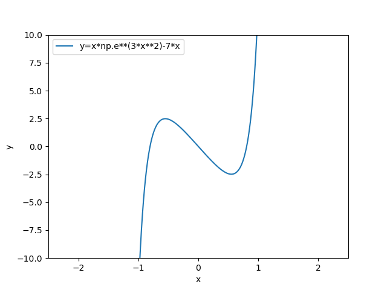

# Fixed Point Iteration

**Routine Name:** fxd_pt_iter

**Author:** Palmer Edholm

**Language:** Python.

**Description/Purpose:** This routine will compute the root of a function using fixed point iteration. With a good guess (i.e., a point close to a root of the function), the routine will return an approximation of the closest root to the guess.

**Input:** There are four input variables in this routine:

* x0: A point near a root of the function.
* f: The objective function. Should be passed in as an anonymous function via the use of a lambda function (e.g., lambda x: x**2).
* tol: Desired tolerance in precision of approximation.
* max_iter: Maximum number of iterations.

**Output:** This routine returns a tuple of the double precision estimate of the root near the specified guess that either achieves the desired tolerance or exceeds the maximum number of iterations specified and the number of iterations performed.

**Usage/Example:**

Say we want to find a root of the function . Using our graphics code, we can plot the function to find a good guess.



We can see that there is a root near positive one. Therefore, we can run the following line of code with precision of 0.0001 and max_iter of 1,000.
```python
print(fxd_pt_iter(1, lambda x: x*np.e**(3*x**2)-7*x, 0.0001, 1000))
```
Output from the lines above:

      (0.8055789837178884, 18)

Since the number of iterations performed is less than the maximum number of iterations passed into the function, we know that the first element of the tuple is the approximated root near 1 with precision 0.0001.

**Implementation/Code:** The following is the code for fxd_pt_iter(x0, f, tol, max_iter)

```python
import numpy as np


def fxd_pt_iter(x0, f, tol, max_iter):
    def g(x):
        return x-(10**(-2))*f(x)
    iters = 0
    error = 10 * max_iter
    while error > tol and iters < max_iter:
        x1 = g(x0)
        error = abs(x1-x0)
        x0 = x1
        iters += 1
    return x1, iters
```

**Last Modified:** October/2021

<hr>

[Previous](graphics.md)
| [Table of Contents](toc/manual_toc.md)
| [Next](bisection.md)

<hr>
