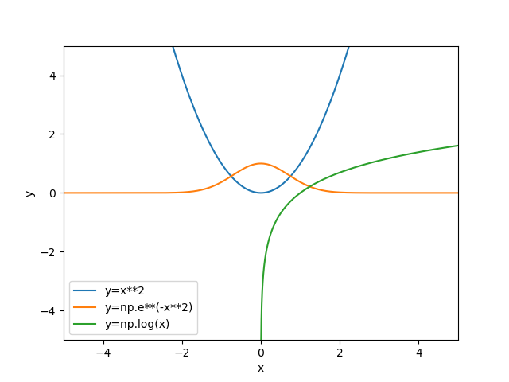

# Python Graphics in Matplotlib

**Routine Name:** graphics

**Author:** Palmer Edholm

**Language:** Python.

**Description/Purpose:** This routine will graph simple functions in Matplotlib. Only simple functions can be graphed, for example, this routine cannot handle trigonometric, logarithmic, or exponential functions.

**Input:** There are five input variables in this routine:

* expression: array variable for functional expressions to be graphed. Array elements should be strings, independent variable should always be x, and there should always be a constant in front of all independent variables (e.g., x^2 needs to be 1x^2).
* xlow: Lowest x value on the graph, default is -10.
* xhigh: Highest x value on the graph, default is 10.
* ylow: Lowest y value on the graph, default is -10.
* yhigh: Highest y value on the graph, default is 10.

**Output:** This routine returns one graph of all functions specified.

**Usage/Example:**

To compare the graphs of standard quadratic and cubic functions, using the default gride size, we can make the following call to our graphics function.
```
graphics(['1x^2', '1x^3'])
```
Output from the line above:



The legend in the top right corner helps to differentiate the different graphs shown.

**Implementation/Code:** The following is the code for graphics(expression, xlow, xhigh, ylow, yhigh)
```
from matplotlib import pyplot as plt
import numpy as np
import regex
from sympy import sympify
from sympy.abc import x


def graphics(expression, xlow=-10, xhigh=10, ylow=-10, yhigh=10):
    # Set size of graph
    plt.xlim([xlow, xhigh])
    plt.ylim([ylow, yhigh])
    # Create values for x-axis
    xvals = np.linspace(xlow, xhigh, 10000)
    # Hard code labels for axes
    plt.xlabel('x')
    plt.ylabel('y')
    # Loop through all strings in array
    for i in range(len(expression)):
        poly = []
        # Insert appropriate math operators
        for term in regex.findall(r'[+-]?\d*\w+\^?\d*', expression[i]):
            term = regex.sub(r'(\d*)([A-Za-z]\w*)(.*)', r'\1*\2\3', term)
            term = term.replace('^', '**')
            poly.append(term)
        poly = ''.join(poly)
        # Parse the polynomial so it's a sympy object
        poly = sympify(poly)
        # Calculate range values
        yvals = [poly.subs(x, y) for y in xvals]
        # Plot the function
        plt.plot(xvals, yvals, label=f'y={expression[i]}')
    plt.legend(loc='best')
    plt.show()
```
**Last Modified:** October/2021

<hr>

[Previous](relerror.md)
| [Table of Contents](toc/manual_toc.md)
| [Next]()

<hr>
