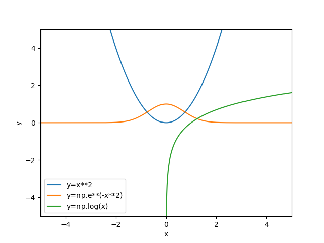

# Python Graphics in Matplotlib

**Routine Name:** graphics

**Author:** Palmer Edholm

**Language:** Python.

**Description/Purpose:** This routine will graph functions using Matplotlib. This routine can be used to compare the graphs of different functions to analyze their properties.

**Input:** There are five input variables in this routine:

* expression: array variable for functional expressions to be graphed. Array elements should be strings, each string should be python code, Numpy methods should be used to graph more complex functions (i.e., np.e, np.log(), np.cos(), etc.)
* xlow: Lowest x value on the graph, default is -10.
* xhigh: Highest x value on the graph, default is 10.
* ylow: Lowest y value on the graph, default is -10.
* yhigh: Highest y value on the graph, default is 10.

**Output:** This routine returns one graph of all functions specified.

**Usage/Example:**

To compare the graphs of a quadratic, exponential, and logarithmic function on a grid with x-values from -5 to 5 and y-values from -5 to 5, we can enter the following code.
```
graphics(['x**2', 'np.e**(-x**2)', 'np.log(x)'], -5, 5, -5, 5)
```
Output from the line above:



The legend in the bottom left corner helps to differentiate the different graphs shown.

**Implementation/Code:** The following is the code for graphics(expression, xlow, xhigh, ylow, yhigh)
```
from matplotlib import pyplot as plt
import numpy as np


def graphics(expression, xlow=-10.0, xhigh=10.0, ylow=-10.0, yhigh=10.0):
    # Set size of graph
    plt.xlim([xlow, xhigh])
    plt.ylim([ylow, yhigh])
    # Create values for x-axis
    xvals = np.linspace(xlow, xhigh, 10000)
    # Hard code labels for axes
    plt.xlabel('x')
    plt.ylabel('y')
    # Loop through all strings in array
    for i in range(len(expression)):
        # Create anonymous function for ith function in expression
        func = lambda x: eval(expression[i])
        # Compute range values of function
        yvals = [func(y) for y in xvals]
        # Plot the function
        plt.plot(xvals, yvals, label=f'y={expression[i]}')
    plt.legend(loc='best')
    plt.savefig('task2.png')
    plt.show()
```
**Last Modified:** October/2021

<hr>

[Previous](relerror.md)
| [Table of Contents](toc/manual_toc.md)
| [Next](fxd_pt_iter.md)

<hr>
