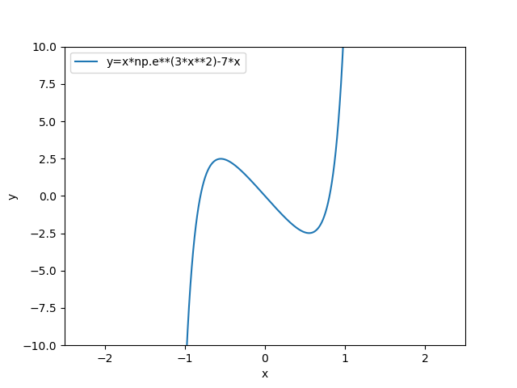

# Hybrid Newton-Bisection Method

**Routine Name:** hybrid

**Author:** Palmer Edholm

**Language:** Python.

**Description/Purpose:** This routine is a more robust root finding method that combines a bisection step to Newton's method to approximate roots. As long as we know an interval that contains at most one root, and an initial guess that is close enough to a root (provided we can calculate the first derivative), a root can be approximated.

**Input:** There are seven input variables in this routine:

* a: Lower bound of the closed interval that contains the root.
* b: Upper bound of the closed interval that contains the root.
* x0: An initial guess that is close enough to the root.
* f: The objective function. Should be passed in as an anonymous function via the use of a lambda function (e.g., lambda x: x**2).
* df: First derivative of f.
* tol: Desired tolerance in precision of approximation.
* max_iter: Maximum number of iterations to perform if tolerance level is too small.

**Output:** This routine returns a double precision estimate of the root closest to x0 and in the interval [a,b].

**Usage/Example:**

If we want to find a root of the function , we can first graph it to see where the roots lie.



As we can see, there is a root in the interval [0.5,1] and close to . We can run the following code to estimate that root.

```python
print(hybrid(0.5, 1.0, 0.9, lambda x: x*np.e**(3*x**2)-7*x, 
             lambda x: np.e**(3*x**2)+6*(x**2)*np.e**(3*x**2)-7, 0.0001, 100))
```

Output from the lines above:

```python
0.8053798665551777
```

The above value is an approximate value of the root in the interval [0.5,1] and near .

**Implementation/Code:** The following is the code for hybrid(a, b, x0, f, df, tol, max_iter)

```python
import numpy as np

def hybrid(a, b, x0, f, df, tol, max_iter):
    # Initialize needed variables
    fa = f(a)
    fb = f(b)
    if fa * fb >0:
        raise Exception('Root not in interval')
    if x0 < a or x0 > b:
        raise Exception('Invalid initial guess')
    f0 = f(x0)
    df0 = df(x0)
    error = 10*tol
    icnt=0
    # Start Newton's method
    while error > tol and icnt < max_iter:
        x1 = x0-f0/df0
        errnewt = abs(x1-x0)
        # Perform 4 iterations of bisection if needed
        if errnewt > error:
            for i in range(4):
                c = 0.5*(a+b)
                fc = f(c)
                if fa*fc<0:
                    b=c
                else:
                    a=c
        error = abs(x1-x0)
        x0 = x1
        f0 = f(x0)
        df0 = df(x0)
        icnt += 1
    return x1
```

**Last Modified:** October/2021

<hr>

[Previous](secant.md)
| [Table of Contents](toc/manual_toc.md)
| [Next]()

<hr>
