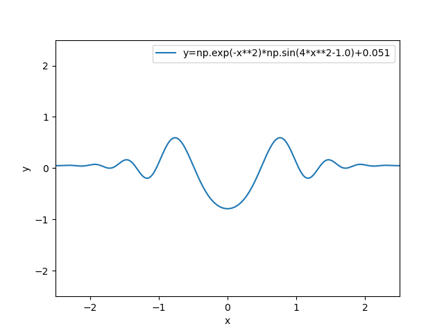

# Hybrid Secant-Bisection Method

**Routine Name:** hybrid_secant

**Author:** Palmer Edholm

**Language:** Python.

**Description/Purpose:** This routine is a more robust root finding method that combines a bisection step to the secant
method to approximate roots. If after one iteration of the Secant method, the error increases, the routine performs four
iterations of bisection to reduce the error. As long as we know an interval that contains at most one root, and two initial
guesses that are close enough to a root, a root can be approximated.

**Input:** There are seven input variables in this routine:

* a: Lower bound of the closed interval that contains the root.
* b: Upper bound of the closed interval that contains the root.
* x0: A first guess that is close enough to the root.
* x1: A second guess that is also close enough to the root.
* f: The objective function. Should be passed in as an anonymous function via the use of a lambda function (e.g., lambda x: x**2).
* tol: Desired tolerance in precision of approximation.
* max_iter: Maximum number of iterations to perform if tolerance level is too small.

**Output:** This routine returns a double precision estimate of the root closest to x0 and x1 and in the interval [a,b].

**Usage/Example:**

If we want to find a root of the function , we can first graph it to see where the roots lie.



As we can see, there is a root in the interval [0.0,0.9] and close to 
and . We can run the following code to estimate
that root with 0.0001 level of tolerance.

```python
f = lambda x: np.exp(-x**2)*np.sin(4*x**2-1.0)+0.051

print(hybrid_secant(0.0, 0.9, 0.3, 0.7, f, 0.0001, 100))
```

Output from the lines above:

```python
0.4836186375653157
```

The above value is an approximate value of the root in the interval [0.0,0.9] and near 
and .

**Implementation/Code:** The following is the code for hybrid_secant(a, b, x0, x1, f, tol, max_iter)

```python
import numpy as np

def hybrid_secant(a, b, x0, x1, f, tol, max_iter):
    # Initialize needed variables
    fa = f(a)
    fb = f(b)
    if (a > 0 and b > 0) or (a < 0 and b < 0):
        raise Exception('Zero not contained in the interval')
    if x0 < a or x0 > b:
        x0 = 0.5*(a+b)
    f0 = f(x0)
    f1 = f(x1)
    error = 10.0*tol
    errsec = 10.0*tol
    icnt = 0
    # Start secant method
    while errsec > tol and icnt < max_iter:
        x2 = x1 - f1*(x1 - x0)/(f1 - f0)
        errsec = abs(x2-x1)
        # Perform 4 iterations of secant method if needed
        if errsec > error:
            for i in range(4):
                c = 0.5*(a+b)
                fc = f(c)
                if fa*fc < 0:
                    b = c
                    fb = fc
                else:
                    a = c
                    fa = fc
            error = abs(b-a)
            x0 = c
            x1 = x2
            f0 = f(c)
            f1 = f(x1)
        else:
            x0 = x1
            x1 = x2
            f0 = f(x0)
            f1 = f(x1)
        icnt += 1
    return x2
```

**Last Modified:** November/2021

<hr>

[Previous](hybrid.md)
| [Table of Contents](toc/manual_toc.md)
| [Next](small_root.md)

<hr>
